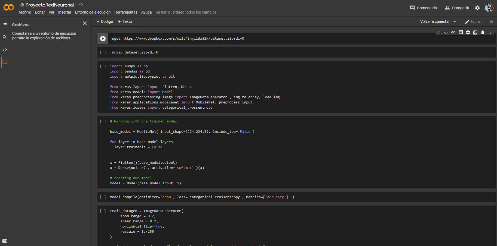
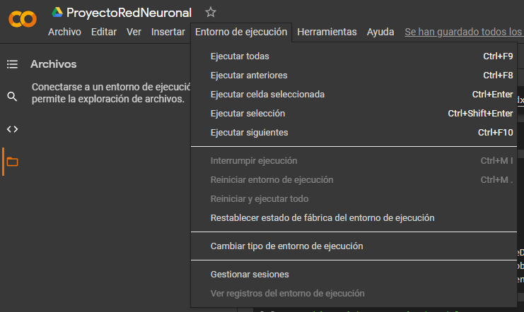

# Repositorio con el código fuente para el proyecto final de la materia investigación de operaciones I

### Paquetes requeridos:

* __OpenCV__: Biblioteca de código abierto enfocada a la utilización de la visión por computadora, esta misma proporciona a la máquina la posibilidad de reconocer
caras u objetos dependiendo de las necesidades del proyecto.
* __NumPy__: Biblioteca que agrega soporte para arreglos y matrices multidimensionales, a la par que una larga colección de funciones matemáticas de alto nivel para operar los objetos anteriores.
* __Pandas__: Biblioteca que define nuevas estructuras de datos basadas en los arrays de la librería NumPy pero con nuevas funcionalidades tales como permitir
acceder a los datos mediante índices o nombres para filas y columnas, utilizar métodos para reordenar, dividir y combinar conjuntos de datos, todo esto sobre ficheros en formato CSV, Excel y bases de datos SQL.
* __Keras__: Biblioteca de software de código abierto que proporciona una interfaz en Python para la creación y utilización de redes neuronales artificiales.

### Utilización:

## Para la utilización del proyecto final se deberán seguir los siguientes pasos:

- Dirigirse al enlance adjunto al libro de google collab

- Hacer clic en la pestaña `Entorno de ejecución` y luego `Ejecutar todas`

- Al hacer esto se correrán todas las celdas de código y posteriormente se generará un nuevo modelo entrenado en la raiz llamado *best_model.h5*

- Si se desea se puede descargar este modelo o utilizar el adjunto en la raiz del repositorio

(Para el siguiente paso se asume que el usuario ya tiene los paquetes requeridos instalados en su sistema)

- Ahora se procederá a ejecutar el archivo *faceEmotionRecog.py* y se abrirá una nueva ventana utilizando la cámara como dispositivo de entrada
en donde se mostrará el rostro del usuario detectado y un label con la emoción que se detecte

- A medida que pasen los minutos con el programa en ejecución, en la consola se desplegará un mensaje con el formato `[minuto] : [emoción]`, con la emoción promedio mayor encontrada para el usuario